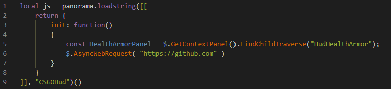

# gamesense-lua-helper README

Add support to identifier of js code in panorama.loadstring of gamesense LUA api.
As also this add panorama.js and gamesense lua code snippets

Lua snippets generated by [this](https://github.com/jessy-lua/vscode-snippets-generator) script from [sapphyrus/docs](https://github.com/gamesensical/docs/)

JS snippets just parsed from [here](https://developer.valvesoftware.com/wiki/CSGO_Panorama_API).

## Features

## Release Notes

Users appreciate release notes as you update your extension.

### 1.0.0

Initial release of extension

**Enjoy!**
